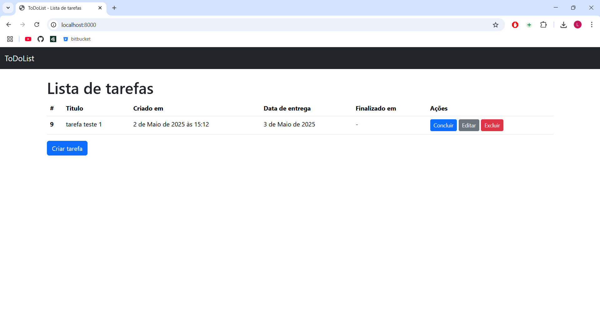
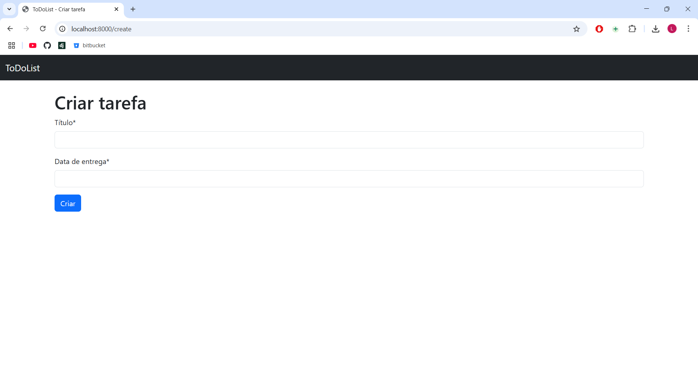
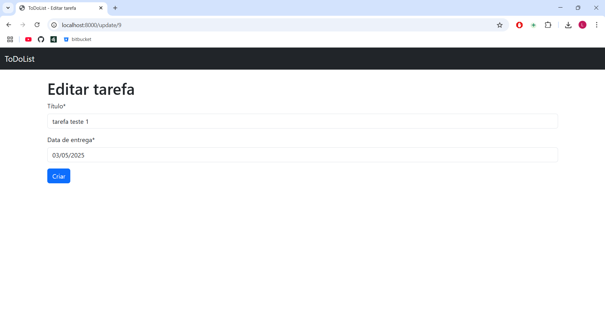
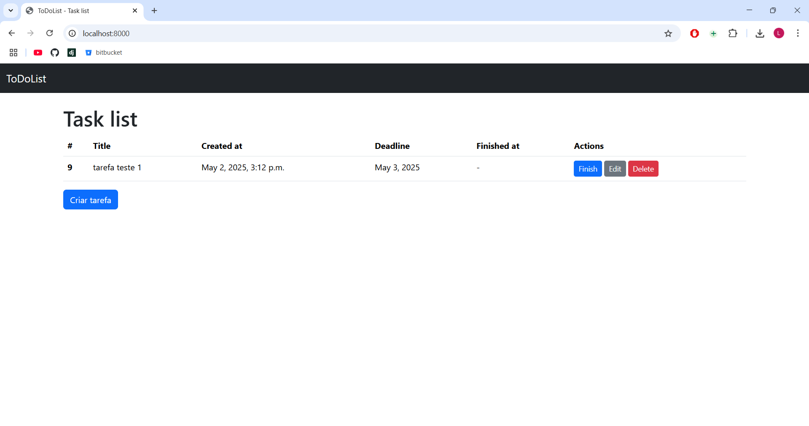
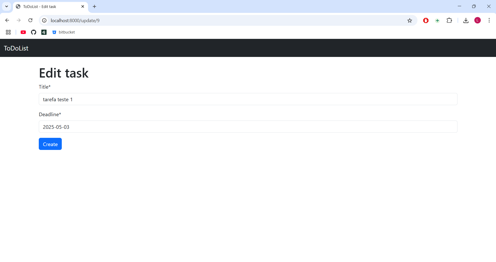

 # 📝 ToDoList App

## 🇧🇷 Português

### 📋 Sobre o Projeto

ToDoList é um aplicativo web simples e eficiente para gerenciamento de tarefas, desenvolvido com Django. Com uma interface intuitiva e recursos essenciais, o ToDoList permite criar, editar, concluir e excluir tarefas de forma organizada.

### ✨ Funcionalidades

- ➕ Adicionar novas tarefas com título e data de entrega
- 📝 Editar tarefas existentes
- ✅ Marcar tarefas como concluídas
- 🗑️ Excluir tarefas
- 📅 Visualizar status e prazos das tarefas

### 🛠️ Tecnologias Utilizadas

- **Backend**: Django 
- **Frontend**: HTML, Bootstrap 5
- **Banco de Dados**: SQLite

### 🚀 Como Executar o Projeto

1. Clone o repositório:
   ```bash
   git clone https://github.com/lucasmarujo/todoapp-django.git
   cd todolist
   ```

2. Crie e ative um ambiente virtual:
   ```bash
   python -m venv .venv
   # Windows
   .venv\Scripts\activate
   # Linux/macOS
   source .venv/bin/activate
   ```

3. Instale as dependências:
   ```bash
   pip install {nome_dependencia}
   ```

4. Execute as migrações:
   ```bash
   python manage.py migrate
   ```

5. Inicie o servidor:
   ```bash
   python manage.py runserver
   ```

6. Acesse o aplicativo em `http://localhost:8000`

### 📸 Capturas de Tela






## 🇺🇸 English

### 📋 About the Project

ToDoList is a simple and efficient web application for task management, developed with Django. With an intuitive interface and essential features, ToDoList allows you to create, edit, complete, and delete tasks in an organized way.

### ✨ Features

- ➕ Add new tasks with title and deadline
- 📝 Edit existing tasks
- ✅ Mark tasks as completed
- 🗑️ Delete tasks
- 📅 View task status and deadlines

### 🛠️ Technologies Used

- **Backend**: Django
- **Frontend**: HTML, Bootstrap 5
- **Database**: SQLite

### 🚀 How to Run the Project

1. Clone the repository:
   ```bash
   git clone https://github.com/lucasmarujo/todoapp-django.git
   cd todolist
   ```

2. Create and activate a virtual environment:
   ```bash
   python -m venv .venv
   # Windows
   .venv\Scripts\activate
   # Linux/macOS
   source .venv/bin/activate
   ```

3. Install dependencies:
   ```bash
   pip install {name_of_lib}
   ```

4. Run migrations:
   ```bash
   python manage.py migrate
   ```

5. Start the server:
   ```bash
   python manage.py runserver
   ```

6. Access the application at `http://localhost:8000`

### 📸 Screenshots





---
